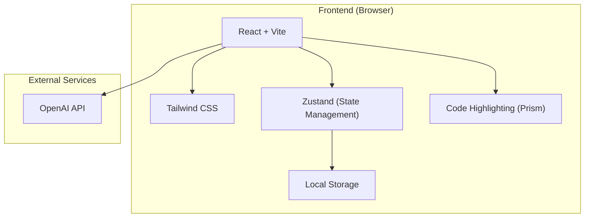

## 1. Architecture Design
纯前端架构，无需后端服务，所有数据本地存储，AI API调用直接从浏览器发起。



## 2. Technology Description
- Frontend: React@18 + TypeScript + tailwindcss@3 + vite
- Initialization Tool: vite-init
- Backend: None (纯前端)
- Database: Local Storage (浏览器本地存储)
- State Management: Zustand
- Code Highlighting: Prism.js

## 3. Route Definitions
| Route | Purpose |
|-------|---------|
| / | 首页 |
| /syntax | 语法指南 |
| /examples | 示例代码 |
| /assistant | AI助手 |

## 4. Data Model
### 4.1 State Management (Zustand)
```typescript
interface AppState {
  currentPage: 'home' | 'syntax' | 'examples' | 'assistant';
  apiKey: string;
  baseUrl: string;
  modelName: string;
  conversations: Conversation[];
  setPage: (page: AppState['currentPage']) =&gt; void;
  setApiConfig: (config: { apiKey: string; baseUrl: string; modelName: string }) =&gt; void;
  addMessage: (conversationId: string, message: Message) =&gt; void;
}

interface Message {
  id: string;
  role: 'user' | 'assistant';
  content: string;
  timestamp: Date;
}

interface Conversation {
  id: string;
  title: string;
  messages: Message[];
  createdAt: Date;
}
```

### 4.2 ST Language Knowledge Base
静态数据存储在前端代码中，包含：
- 语法指南数据
- 5个示例代码
