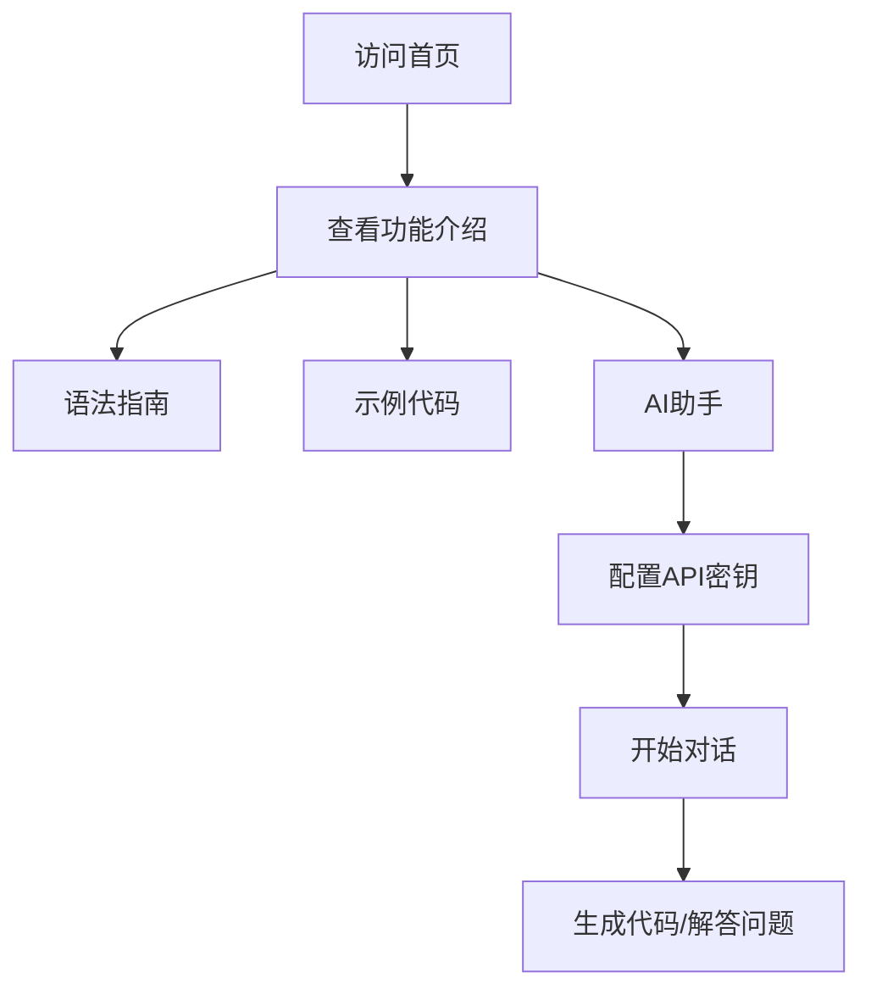

## 1. Product Overview
ST语言编程助手Web版是一个基于浏览器的交互式编程学习和代码生成工具，专为PLC编程人员设计，提供ST语言语法参考、示例代码库和AI辅助编程功能。
- 解决需要安装Python环境才能使用ST语言助手的问题，目标用户是PLC编程工程师和学习ST语言的学生
- 提供美观、易用的Web界面，降低ST语言学习门槛

## 2. Core Features

### 2.1 User Roles
| Role | Registration Method | Core Permissions |
|------|---------------------|------------------|
| Visitor | No registration needed | Access all features, view examples, use AI assistant with their own API key |

### 2.2 Feature Module
1. **首页**: 英雄区域、导航、功能介绍
2. **语法指南**: ST语言完整语法参考
3. **示例代码**: 5个实用PLC编程示例
4. **AI助手**: 交互式对话、代码生成、问题解答

### 2.3 Page Details
| Page Name | Module Name | Feature description |
|-----------|-------------|---------------------|
| 首页 | Hero section | 项目名称、副标题、快速开始按钮、动画效果 |
| 首页 | 功能卡片 | 展示三个核心功能：语法指南、示例代码、AI助手 |
| 语法指南 | 语法分类 | 按语法类型分类展示，可折叠/展开 |
| 语法指南 | 代码高亮 | ST语言代码高亮显示 |
| 示例代码 | 示例列表 | 5个示例卡片，包含启保停、状态机、定时器、模拟量、PID |
| 示例代码 | 代码查看器 | 完整代码展示、一键复制 |
| AI助手 | 对话界面 | 聊天式交互界面 |
| AI助手 | 配置面板 | API密钥和模型配置 |

## 3. Core Process
用户访问Web应用 → 浏览首页了解功能 → 查看语法指南学习ST语言 → 参考示例代码 → （可选）配置API密钥使用AI助手进行对话和代码生成

## 4. User Interface Design

### 4.1 Design Style
- **Primary color**: 工业蓝 (#2563eb)
- **Secondary color**: 电气橙 (#f97316)
- **Button style**: 圆角矩形，悬浮时轻微上移和阴影增强
- **Font**: 现代无衬线字体 (Space Grotesk + Geist Mono)
- **Layout style**: 卡片式布局，网格排列
- **Icon style**: 线性图标，工业/电子元素风格
- **Background**: 深色主题搭配网格背景纹理，营造科技感

### 4.2 Page Design Overview
| Page Name | Module Name | UI Elements |
|-----------|-------------|-------------|
| 首页 | Hero section | 大标题、渐变文字、玻璃态卡片、脉冲动画按钮、网格背景 |
| 首页 | 功能卡片 | 3列卡片网格，图标+标题+描述，hover缩放效果 |
| 语法指南 | 分类面板 | 可折叠手风琴组件，代码块高亮 |
| 示例代码 | 示例网格 | 卡片网格，点击查看详情 |
| AI助手 | 聊天界面 | 气泡对话，代码块一键复制，打字机动画 |

### 4.3 Responsiveness
- Desktop-first设计，1200px+完整布局
- 平板设备 (768-1199px): 2列网格
- 移动设备 (&lt;768px): 单列布局，优化触摸交互
